# Frontend Mentor - Fylo dark theme landing page solution

This is a solution to the [Fylo dark theme landing page challenge on Frontend Mentor](https://www.frontendmentor.io/challenges/fylo-dark-theme-landing-page-5ca5f2d21e82137ec91a50fd). Frontend Mentor challenges help you improve your coding skills by building realistic projects. 

## Table of contents

- [Overview](#overview)
  - [The challenge](#the-challenge)
  - [Screenshot](#screenshot)
  - [Links](#links)
- [My process](#my-process)
  - [Built with](#built-with)
  - [What I learned](#what-i-learned)
  - [Continued development](#continued-development)
  - [Useful resources](#useful-resources)
- [Author](#author)
- [Acknowledgments](#acknowledgments)


## Overview

### The challenge

Users should be able to:

- View the optimal layout for the site depending on their device's screen size
- See hover states for all interactive elements on the page

### Screenshot

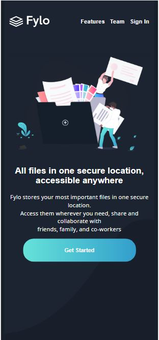
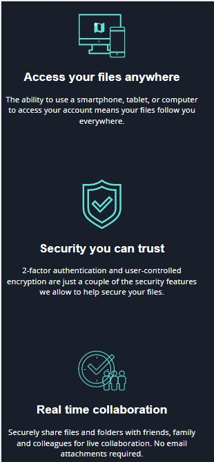
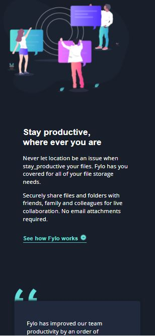
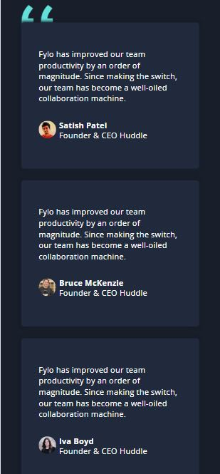
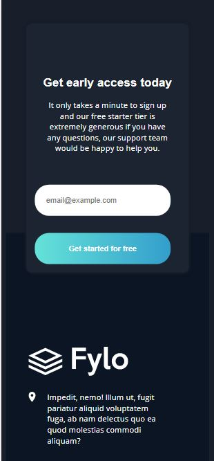
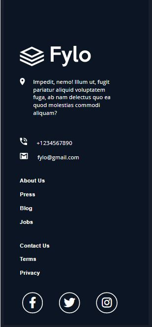
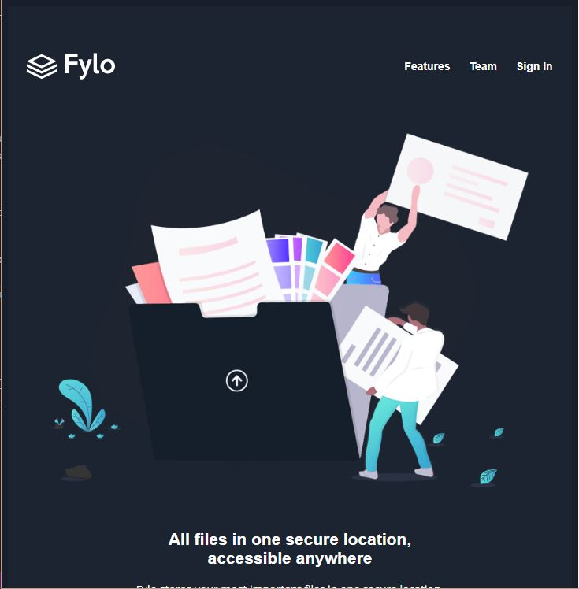
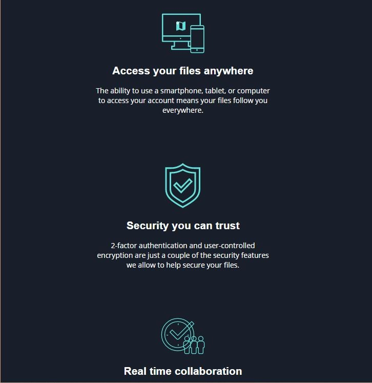
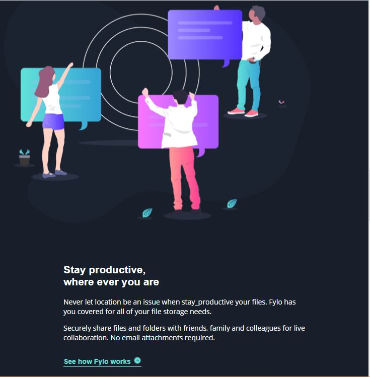
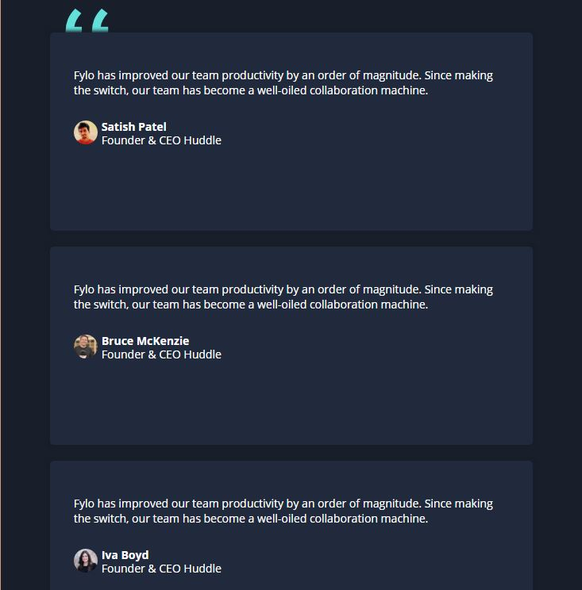
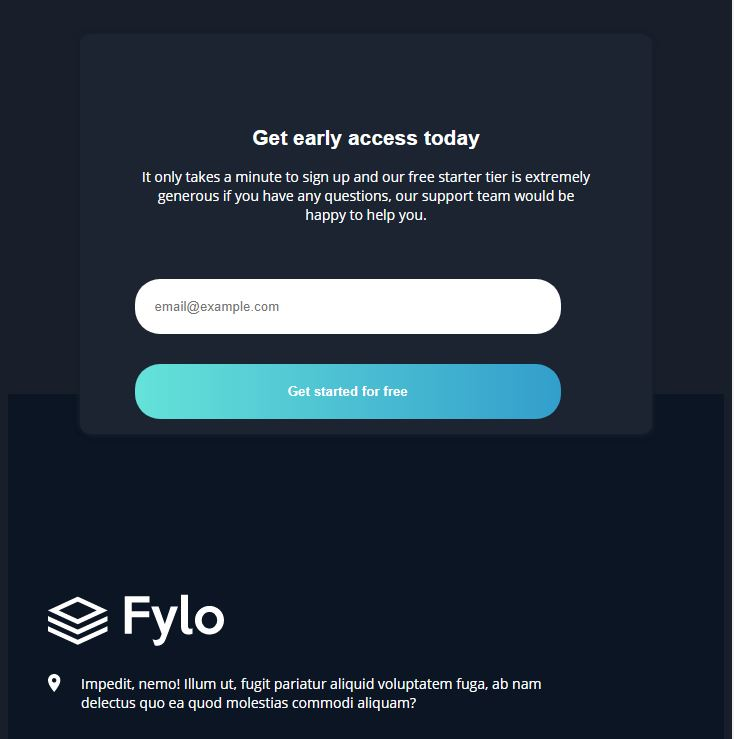
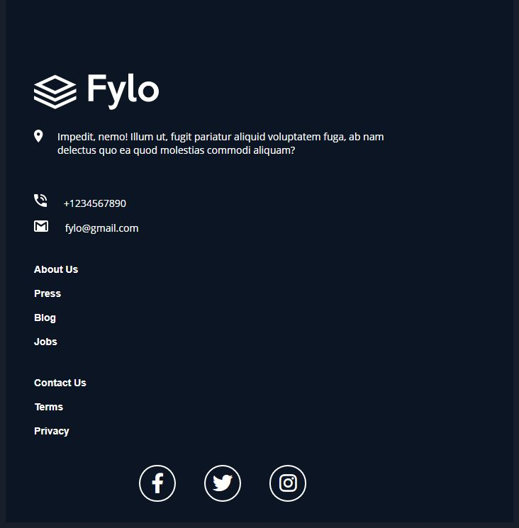
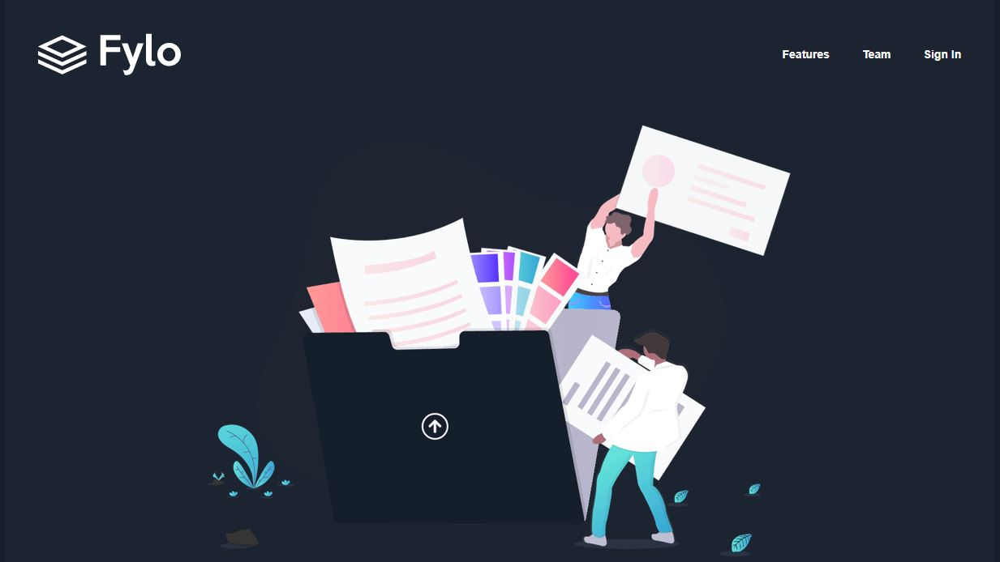
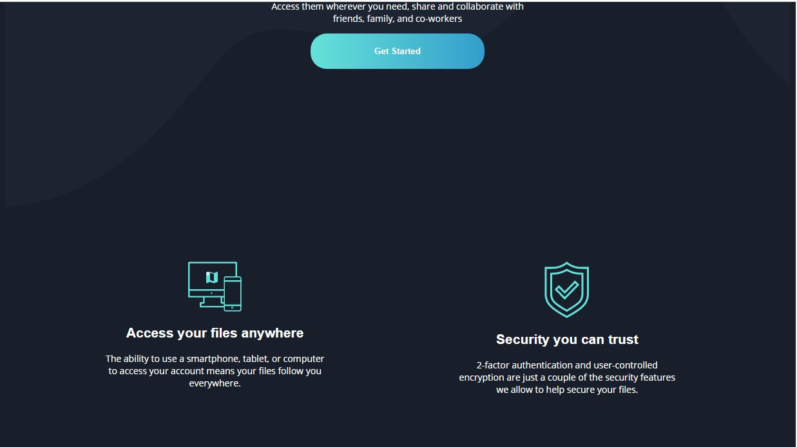
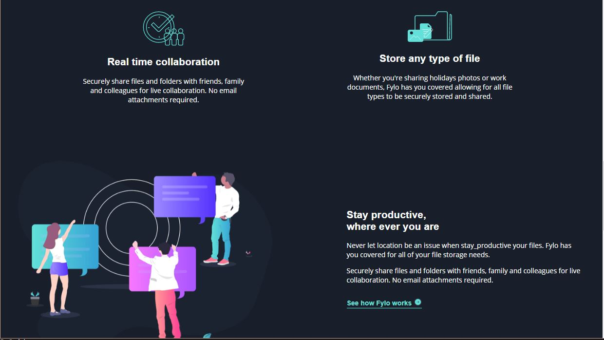
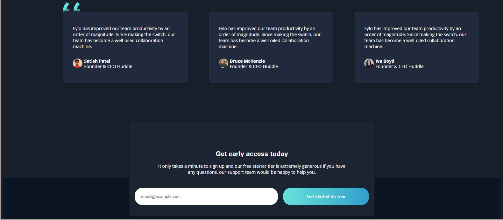
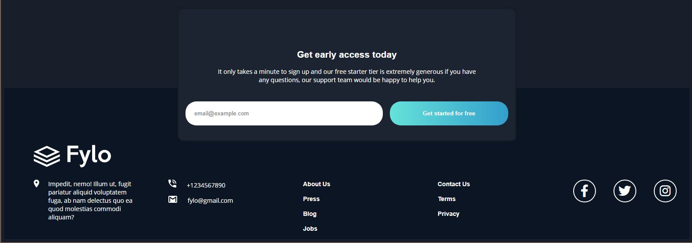


### Links

- Solution URL: [GitHub repository](https://GitHub.com/Austinet/fylo-dark-theme-landing-page-by-austinet.git)
- Live Site URL: [Live Site](https://austinet.github.io/fylo-dark-theme-landing-page-created-by-austinet)

## My process

### Built with

- Semantic HTML5 markup
- CSS custom properties
- Flexbox
- CSS Grid
- Laptop-first workflow
- Visual Studio Code
- Google fonts
- Font Awesome

### What I learned

I learnt a lot while undergoing this task, especially getting to learn and implement CSS Flexbox and Grid. I'm used to float and CSS Box model to position my contents and style my layouts. This is far more easier especially to create responsive websites. 

```html
<div class="container">
  <div> Content 1</div>
  <div> Content 2 </div>
  <div> Content 3</div>
  <div> Content 4</div>
</div>
```
```css
.container {
  color: papayawhip;
  display: flex;  /* Using Flexbox */
  justify-content: center;
}

/* To make it responsive */
 @media(max-width:375px){
     .container{
       flex-direction:column;
     }
 }
```

### Continued development

Now I have gotten a good background on HTML and CSS, I will move to Javascript in order to complete my Frontend course. And the technique I learnt from this project that I will stick to, is using CSS Flexbox and Grid to make responsive websites.


### Useful resources

- [ Youtube](https://www.Youtube.com) 
- [Google  ](https://www.Google.com) 

## Author

- Frontend Mentor - [@austinet](https://www.frontendmentor.io/profile/austinet)
- Twitter - [@udhe.austine](https://www.twitter.com/udhe.austine)


## Acknowledgments

I will like to acknowledge God for giving me the grace to be patient with myself while going through the huddles of carrying out this project. And also Front end mentor, Side Hustle team for linking me up to my first completed real life web development project. And also Google, Youtube and ctrl+z lol.

